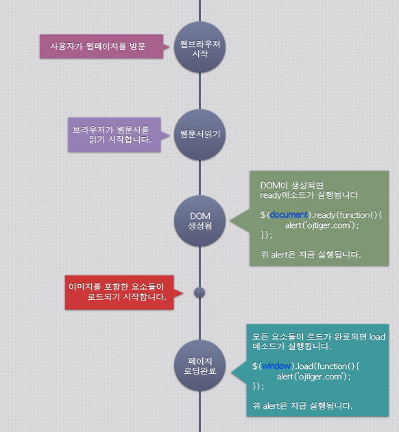

# jQuery Start

*jQuery는 자바스크립트 라이브러리로 매우 빠르고, 가볍고, 강력하다.*

*DOM을 통해 HTML문서를 빠르게 순회(Traversing)하여 요소를 선택(Selecting)하고, 조작(Manipulating)한다.*


### 1. jQuery 설치

> jQuery는 다운로드 또는 구글CDN을 가져와 문서에 포함시켜 사용할 수 있다.

**1-1. 다운로드**

[http://jquery.com/download/](http://jquery.com/download/)

**1-2. 구글 CDN**

```html
<head>
  <script src="https://ajax.googleapis.com/ajax/libs/jquery/3.2.1/jquery.min.js"></script>
</head>
```
---

### 2. window.onload VS jQuery().ready()

> window.onload = function( ) { };
>
> 문서의 모든 내용(이미지 포함)이 다운로드 되면 실행한다.


> jQuery(document).ready(function( ) { });
>
> 문서의 DOM구조만 완성되면 바로 실행한다.





**# jQuery().ready() 함수 속기형 작성**

 **☞ $(function( ) {...});**

---

### 3. $ Conflict

*대부분의 라이브러리의 참조 키워드가 $이기 때문에*

*jQuery를 $에 참조할 경우, 다른 라이브러리(prototype, dojo...)와 충돌이 일어날 수 있다.*


**이를 해결하기 위해서는**

> jQuery.noConflict( )를 선언하고, jQuery를 사용하거나 다른 키워드로 참조하게 되면 충돌을 방지할 수 있다.
>
> * jQuery.noConflict( );
>
>
> * var j = jQuery.noConflict( );
>
>   j(function( ) {....});